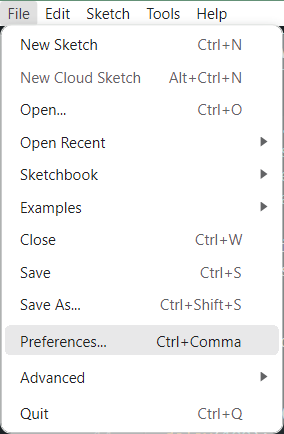

# 📡 ESP32Website V1.1.0

**ESP32Website** là một thư viện hỗ trợ xây dựng giao diện web cho ESP32, bao gồm các chức năng xem log, gửi lệnh thời gian thực qua WebSocket, và truy cập/đọc dữ liệu từ thẻ SD. Dễ dàng tích hợp và mở rộng cho các dự án IOT, debug, giám sát thiết bị...

## 🔧 Tool chuyển định dạng html sang gzip
- Làm giảm dung lượng giao diện web nạp vào thiết bị
- Để sử dụng bạn cần cài đặt `Python` về máy
- Mở `command line` tại thư mục chứa tool
- Sử dụng câu lệnh `python convert.py mode file1 file2`
- Với mode `to_array` để chuyển từ `.html` sang `.h`, `to_html` chuyển từ `.h` sang `.html`
- Tên file cần nhập tên và đuôi định dạng ví dụ ` python convert.py to_array file1.html file1.h`
- Nếu bạn muốn chuyển từ `.h` sang `.html` hãy chỉ để dãy số trong file `.h`

## 📁 Thư viện con

### 1. `WebSerialMonitor 1.0.1`
> Giao tiếp WebSocket 2 chiều như Serial Monitor.

- Gửi lệnh từ trình duyệt tới ESP32.
- ESP32 phản hồi tức thời về client thông qua WebSocket.
- Hỗ trợ lệnh khởi động lại, bật/tắt thiết bị,...
- Theo dõi log Serial Monitor không cần kết nối cáp dữ liệu/

### 2. `WebReadSDCard 1.0.1`
> Thao tác với thẻ SD Card
- Xem thông tin thẻ nhớ: Dung lượng tổng, dung lượng đã sử dụng, dung lượng còn lại/
- Thao tác: Xóa, Thêm, Đổi tên file trên thẻ nhớ/

### 3. `ElegentOTA`
> Nạp firmware qua OTA
- Tạo 1 webserver cho phép người dùng tải và nạp firmware qua OTA mà không cần kết nối trực tiếp dành cho các thiết bị ở vị trí khó tiếp cận/
- Sử dụng thư viện có sẵn của ElegentOTA và được sửa lại giao diện web cho đồng bộ màu với thư viện.

## Cách sử dụng
### B1: Tải thư viện ESP32Website về máy
### B2: Tạo file .ino ngay trong folder ESP32Website
### B3: Cài đặt Sketchook location về Folder ESP32Website

